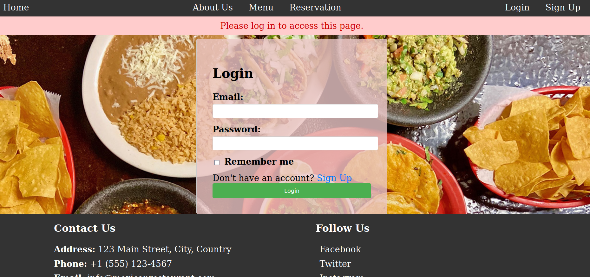
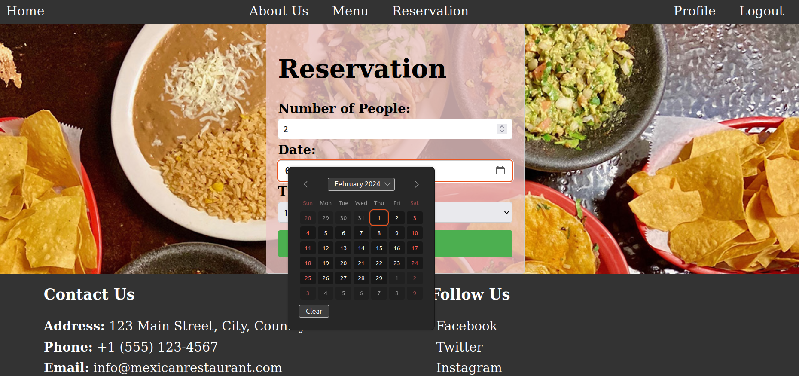

# restaurant-page
A basic restaurant page using Flask & Postgresql 
Demo run with: `flask --app init run`
Admin view: http://127.0.0.1:5000/admin/

Functionalities:
- Login page
- Table Reservation
- Dynamic Menu site

To do:
- Add a shopping cart to order food

